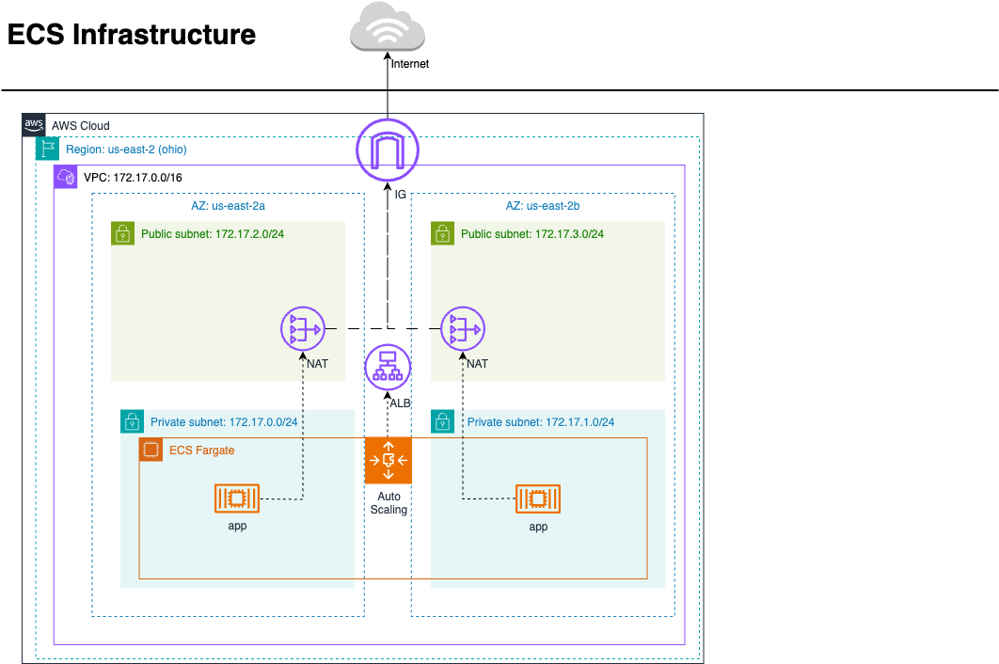

# AWSCongreso2025 — App en ECS Fargate

Demo para el congreso de la U: despliegue de una aplicación web contenerizada en
**AWS ECS Fargate** usando **Terraform**, con CI/CD vía GitHub Actions.

## Estructura del repositorio

| Carpeta / archivo         | Descripción                                                        |
|---------------------------|--------------------------------------------------------------------|
| `app/`                    | App web estática (Nginx) — página "Hola Universidad" + `Dockerfile`|
| `terraform-fargate/`      | Infraestructura en AWS (VPC, ALB, ECS Fargate, autoscaling, logs)  |
| `.github/workflows/`      | Pipeline CI/CD: build → push a ECR → deploy a ECS                  |
| `aws.png` / `aws.drawio`  | Diagrama de la arquitectura                                        |

## Inicio rápido

Toda la infraestructura vive en `terraform-fargate/`. Consulta su
[README](terraform-fargate/Readme.md) para los pasos detallados:

```bash
export AWS_ACCESS_KEY_ID="..."
export AWS_SECRET_ACCESS_KEY="..."
export AWS_SESSION_TOKEN="..."       # solo con credenciales temporales

cd terraform-fargate
terraform init
terraform plan
terraform apply
```

Al finalizar, abre la URL `alb_hostname` que imprime Terraform para ver la app.

> **⚠️ Recuerda** ejecutar `terraform destroy` al terminar la demo: el stack
> (NAT Gateways, ALB, Fargate) genera costos mientras esté desplegado.

## Diagrama del proyecto


